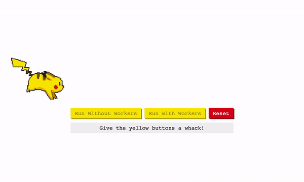

<p align="center">
  
  <h1 align="center">PikaWorker</h1>
</p>

<p align="center">
  
  
</p>

<p align="center">
  <b>A demo to illustrate a web workers advantage (using Pikachu running as an example).</b><br>
</p>

<br>

## What is this?

This repo demos the advantages of using a web worker to solve the UI being clogged up, this results in a better overall experience as it keeps our apps interative whilst performing heavy computations. 

<br>

<p align="center">
  <br>
  <sub>(Example taken from the codepen example, found <a href="https://codepen.io/munaibh/pen/QXoJQB">here</a>)</a></sub>
</p>
<br>


## An explanation.

> A way to solve "jank" on the web is to stop intensive tasks/calculations running on the main thread and instead run operations adjacent to the main thread. This results in the main thread being freed; it can now perform UI operations which result in the app remaining interactive.

```javascript
// index.js
if(window.Worker) {
	const myCoolWorker = new Worker('worker.js')
	myCoolWorker.onMessage = e => console.log(`Message ${e.data}`)
	myCoolWorker.postMessage(id)
}
```

To create a `worker` all we do is instantiate a new worker and point it to a worker file. Next, we set an `onmessage` handler which acts as our communications channel for it to chat to us. Lastly, we send a `postMessage`  to kick off the worker (we also send it some data, in this case an `id`).

```javascript
// worker.js
onmessage = async function(e) {
	const id = e.data
	const response = await fetch(`/do/cool/stuff/${id}`)
	const data = await response.json()
	self.postMessage(data);
}
```

In the worker itself we have an `onmessage` handler in which we are receiving the passed `id`  and we're doing a some arbitrary logic (in this case a fetch) and then passing the result back up. 

The worker is useful as here we can offload a ton of logic (e.g. transformations that are computationally heavy). Doing this won't "jank" out our UIs and allows everything to remain interactive.

<br>
<h3 align="center">
  Pretty Cool! 🤙
</h3>


